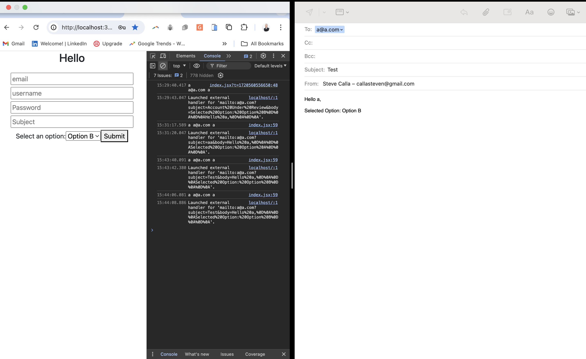

# Basic Email Option - Using "mailto" in React

[](https://opensource.org/licenses/MIT)


## Description

```
As a coding bootcamp student.

I WANT to implement MVP level email functionality using form input.

SO THAT an email can be sent when a user clicks on the form submit button.
````

## Website Preview

### Static Screenshots

* App with side by side view of the open email default including populated email, subject & body


## Installation

#### Setup:<br>
(1) Clone the repo<br>
(2) Run `npm install` (to install the dependencies)<br>
(3) `npm start` to build and run via Vite<br>

## Resources

[Stack Overflow of MailTo Option](https://stackoverflow.com/questions/63782544/react-open-mailto-e-mail-client-onclick-with-body-from-textarea)

[Support Docs: `<a>` element - MDN Web Docs](https://developer.mozilla.org/en-US/docs/Web/HTML/Element/a)


## Tests

No tests at this time.

## Contributing

Contributor Covenant Code of Conduct

[](https://www.contributor-covenant.org/version/2/1/code_of_conduct/code_of_conduct.md)

## Collaborators

1.  [Steve Calla - GitHub Profile](https://github.com/stevecalla)

## Resources

1. GitHub Repo: <https://github.com/stevecalla/attendance_app_edx>
2. Heoku Deployed App: Not deloyed
3. Walk-Through Video: None

## License

[](https://opensource.org/licenses/MIT)
This project is licensed under the terms of the <span style="color:red">The MIT License</span>. Please click on the license badge for more information.
